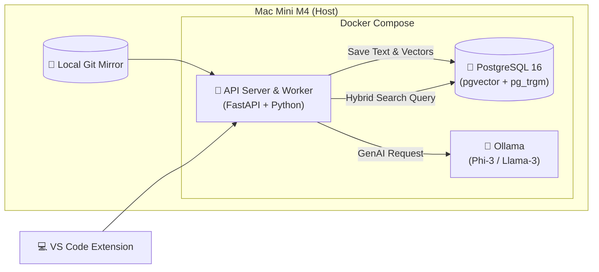

# Lite Code Search Engine (Mac mini Edition) — Implementation Master Plan (No Omissions)

> **Target:** Mac mini M4 (24GB RAM)  
> **Team:** 2~3 Developers  
> **Architecture:** Monolithic PostgreSQL (Unified Search DB)  
> **Goal:** 로컬/사내망에서 동작하는 **고효율 Monorepo 코드 검색 엔진** 구축 (키워드 + 벡터 하이브리드 + RAG)  
> **Core Principle:** 관리 포인트를 **PostgreSQL 1개**로 통합하여 운영/장애 대응 비용 최소화

---

## 0. 핵심 요약 (Why This Works)

- **비용 0원:** 추가 클라우드 없이 로컬 하드웨어 활용
- **보안:** 코드/임베딩/요약이 모두 로컬에서 처리되어 유출 위험 최소화
- **단순함:** “DB가 죽었어요” → “Postgres만 켜면 됨” 수준으로 운영 단순화
- **검색 품질:** 텍스트(FTS + Trigram) + 의미(Vector) 조합으로 개발자 사용성 강화

---

## 1. 아키텍처 오버뷰 (Lite Model)

기존 4~5개 컨테이너 구성에서 **3개(App, DB, LLM)**로 압축해 메모리 오버헤드를 줄입니다.

### 1.1 System Diagram



### 1.2 Resource Budget (Total 24GB)

| 서비스 | 할당 메모리 | 역할 | 비고 |
| :--- | :--- | :--- | :--- |
| **MacOS** | ~4 GB | 운영체제 및 기본 프로세스 | - |
| **PostgreSQL** | **4 GB** | 텍스트 검색(FTS) 및 벡터 저장 | `shared_buffers` 최적화 필요 |
| **API Server** | **2 GB** | 파싱(Tree-sitter), 임베딩 생성 | 인덱싱 시점에 CPU 사용량 증가 |
| **Ollama** | **6~8 GB** | RAG 및 코드 요약 (Llama-3 8B 4bit) | 필요 시 로드/언로드 |
| **Dev Tools** | ~6 GB | 팀원 개발용 (IDE, Browser) | 여유 공간 확보 필수 |

---

## 2. 기술 스택 (Tech Stack)

복잡도를 낮추기 위해 **Python 생태계**로 통일합니다.

### 2.1 Backend
- **Python 3.11+**
- **FastAPI**
  - 비동기 처리 강점
  - AI 라이브러리(LangChain 등) 및 모델 연동 용이

### 2.2 Database
- **PostgreSQL 16**
- Extensions:
  - `pgvector`: 벡터 저장/검색
  - `pg_trgm`: 유사 문자열 검색
  - `ko_rdict`: 한국어 형태소 분석(옵션)

### 2.3 Indexer
- Parser: `tree-sitter` (Python binding)
- Embedding: `sentence-transformers/all-MiniLM-L6-v2` (384차원)
  - 매우 가볍고 빠름 (로컬 CPU 기반)
  - 384차원은 저장/인덱스 메모리 비용 절감에 유리

### 2.4 LLM Serving
- **Ollama**
  - Model: `phi-3-mini (3.8B)` 또는 `llama-3-8b-quantized`

---

## 3. 데이터베이스 스키마 설계 (Unified Schema)

PostgreSQL 하나로 **메타데이터 + 전문 검색 + 벡터 검색**을 모두 처리합니다.

### 3.1 Base Schema (Original)

```sql
-- 1. 확장 설치
CREATE EXTENSION IF NOT EXISTS vector;
CREATE EXTENSION IF NOT EXISTS pg_trgm;

-- 2. 리포지토리 관리 테이블
CREATE TABLE repositories (
    id SERIAL PRIMARY KEY,
    name VARCHAR(255) NOT NULL,
    remote_url VARCHAR(512) NOT NULL,
    last_synced_at TIMESTAMP,
    branch VARCHAR(100) DEFAULT 'main'
);

-- 3. 코드 블록 통합 테이블 (핵심)
CREATE TABLE code_blocks (
    id BIGSERIAL PRIMARY KEY,
    repo_id INT REFERENCES repositories(id),
    file_path TEXT NOT NULL,
    
    -- 코드 블록 메타데이터
    symbol_name TEXT,       -- 함수/클래스명
    block_type VARCHAR(50), -- function, class, interface
    start_line INT,
    end_line INT,
    language VARCHAR(50),   -- python, typescript, java...
    
    -- 검색 데이터
    content TEXT NOT NULL,                -- 코드 원문
    search_vector TSVECTOR,               -- [Text Search] 키워드 검색용 역색인
    embedding VECTOR(384),                -- [Vector Search] 의미 검색용 (MiniLM 기준)
    
    updated_at TIMESTAMP DEFAULT NOW()
);

-- 4. 인덱스 최적화
-- 텍스트 검색 속도 향상 (GIN Index)
CREATE INDEX idx_code_content_ts ON code_blocks USING GIN(search_vector);

-- 벡터 검색 속도 향상 (HNSW Index - 메모리 좀 쓰지만 빠름)
CREATE INDEX idx_code_embedding ON code_blocks USING hnsw (embedding vector_cosine_ops);

-- 파일 경로/심볼명 검색용 (Trigram)
CREATE INDEX idx_file_path_trgm ON code_blocks USING GIN (file_path gin_trgm_ops);
```

---

## 4. 구현 로드맵 (Step-by-Step)

### Phase 1: 환경 구성 (Infrastructure)
- [ ] Docker Compose 작성 (`postgres`, `ollama`, `app`).
- [ ] PostgreSQL 데이터 영구 저장을 위한 Volume 설정.
- [ ] 로컬 Git Mirror 디렉토리 생성 및 권한 설정.

### Phase 2: 인덱서 개발 (Indexer Engine)
- [ ] **Git Sync:** `git fetch` 후 변경된 파일 목록(`diff`)만 추출하는 파이썬 스크립트 작성.
- [ ] **Parsing:** `tree-sitter`로 지원 언어(TS, Java, Py, Go)별 파서 구현.
  - 전략: 파일 전체가 아닌 `function` 단위로 Chunking.
- [ ] **Embedding:** 로컬 CPU로 `all-MiniLM-L6-v2` 모델을 돌려 벡터 생성.
- [ ] **Upsert:** DB에 `(file_path, symbol)` 키를 기준으로 기존 데이터 갱신/삽입.

### Phase 3: 하이브리드 검색 API (Search Layer)
- [ ] **Query Processing:** 사용자 입력을 텍스트 키워드와 벡터로 변환.
- [ ] **Hybrid SQL 작성:**
  - (1) `ts_rank` (키워드 매칭 점수)
  - (2) `1 - (embedding <=> query_vector)` (코사인 유사도)
  - (3) Final Score = `(TextScore * 0.4) + (VectorScore * 0.6)`
- [ ] **Reranking (Optional):** 상위 20개를 최신 수정일 가중치 등으로 재정렬.

### Phase 4: RAG & IDE 연동 (Application)
- [ ] **RAG API:** 검색된 코드(Top 3)를 프롬프트에 넣어 Ollama에게 "설명해줘" 요청.
- [ ] **VS Code Extension (MVP):**
  - 기능: 사이드바에 검색창 1개.
  - 액션: 엔터 치면 결과 리스트 표시, 클릭 시 해당 파일 라인으로 이동.

---

## 5. Mac mini M4 최적화 팁 (Original)

1. **Swap Memory 활용**
   - Docker Desktop 설정에서 RAM 할당을 너무 타이트하게 잡지 않기
   - MacOS 메모리 압축 + Swap(약 4GB~8GB) 허용 권장

2. **임베딩 모델의 경량화**
   - 768차원 이상 대신 **384차원 MiniLM**
   - DB 저장 용량/검색 메모리 사용량 절반 수준으로 절감
   - 한국어 주석 검색 성능도 준수

3. **인덱싱 스케줄링**
   - 낮 시간(업무 시간)에 Full Scan 금지
   - Webhook 기반 증분 업데이트만 실시간 처리
   - Full Scan은 새벽 3시에 `cron`으로 실행

---

## 6. 결론: 이 플랜의 장점 (Original)

- **비용 0원:** 이미 보유한 하드웨어 활용
- **보안:** 모든 코드가 로컬(사내망) 안에서만 처리
- **단순함:** 장애 포인트 축소 (Postgres 중심), 유지보수 용이

---

# 7. 실구현 품질을 위해 반드시 추가하는 보강 전략 (No Omissions)

> 아래 항목은 위 원본 플랜을 **실제 서비스급**으로 만들기 위한 필수 보강입니다.

## 7.1 Upsert 기준(유니크 키) 명확화
원본 기준 `(file_path, symbol)`만으로는 충돌 가능:
- 동일 파일에 동일 함수명
- 오버로드/스코프 차이
- 언어/블록 타입에 따른 중복

**권장 유니크 키:**
- `(repo_id, file_path, symbol_name, block_type, start_line)`
- 또는 Tree-sitter node 범위 기반 `block_hash`(stable id) 생성 후 Upsert

## 7.2 search_vector 자동 생성(Generated Column)로 누락 방지
인덱서가 `content`만 넣으면 Postgres가 `search_vector`를 자동 생성하게 하여
- 데이터 누락/불일치
- 인덱서 코드 복잡도
를 줄입니다.

## 7.3 삭제 처리(Deleted File / Removed Block) 전략
증분 인덱싱 시 삭제된 파일/블록이 DB에 남으면 검색 결과 오염.

- 소프트 삭제 추천:
  - `is_deleted BOOLEAN`
  - `deleted_at TIMESTAMP` (옵션)
- 또는 repo 단위 “현재 파일 목록” 기반 청소(가끔 수행)

## 7.4 하이브리드 점수의 스케일 차이 문제 해결 (정규화)
`ts_rank`와 cosine score는 범위/분포가 달라 그대로 가중합하면 흔들립니다.

- 후보군(candidates)을 뽑고
- 각 점수를 0~1로 정규화 후 가중합하는 방식이 안정적

---

# 8. 개선된 스키마 (Recommended Production-Lite Schema)

```sql
CREATE EXTENSION IF NOT EXISTS vector;
CREATE EXTENSION IF NOT EXISTS pg_trgm;

-- 리포
CREATE TABLE IF NOT EXISTS repositories (
  id SERIAL PRIMARY KEY,
  name VARCHAR(255) NOT NULL,
  remote_url VARCHAR(512) NOT NULL,
  branch VARCHAR(100) DEFAULT 'main',
  last_synced_at TIMESTAMP,
  created_at TIMESTAMP DEFAULT NOW()
);

-- 코드 블록
CREATE TABLE IF NOT EXISTS code_blocks (
  id BIGSERIAL PRIMARY KEY,
  repo_id INT NOT NULL REFERENCES repositories(id) ON DELETE CASCADE,
  file_path TEXT NOT NULL,

  symbol_name TEXT,
  block_type VARCHAR(50),
  start_line INT,
  end_line INT,
  language VARCHAR(50),

  content TEXT NOT NULL,

  -- content 기반 자동 계산 (Postgres 12+)
  search_vector TSVECTOR GENERATED ALWAYS AS (
    to_tsvector('simple', coalesce(content,'') || ' ' || coalesce(symbol_name,'') || ' ' || coalesce(file_path,''))
  ) STORED,

  embedding VECTOR(384),

  -- 변경/삭제 관리
  content_hash TEXT,
  is_deleted BOOLEAN DEFAULT FALSE,
  updated_at TIMESTAMP DEFAULT NOW(),
  created_at TIMESTAMP DEFAULT NOW()
);

-- Upsert 기준
CREATE UNIQUE INDEX IF NOT EXISTS uq_code_blocks_identity
ON code_blocks (repo_id, file_path, coalesce(symbol_name,''), coalesce(block_type,''), start_line);

-- 인덱스
CREATE INDEX IF NOT EXISTS idx_code_search_vector ON code_blocks USING GIN(search_vector);
CREATE INDEX IF NOT EXISTS idx_code_embedding ON code_blocks USING hnsw (embedding vector_cosine_ops);

CREATE INDEX IF NOT EXISTS idx_file_path_trgm ON code_blocks USING GIN (file_path gin_trgm_ops);
CREATE INDEX IF NOT EXISTS idx_symbol_trgm ON code_blocks USING GIN (symbol_name gin_trgm_ops);

-- 필터/성능용
CREATE INDEX IF NOT EXISTS idx_repo_active ON code_blocks(repo_id, is_deleted);
```

> `to_tsvector('simple', ...)`는 형태소 엔진 없는 환경에서 가장 안전한 기본값입니다.  
> 한국어 형태소 강화는 Lite 목표에서 옵션으로 유지합니다.

---

# 9. Docker Compose (Mac mini M4 현실 운영용 골격)

```yaml
services:
  db:
    image: postgres:16
    environment:
      POSTGRES_PASSWORD: postgres
      POSTGRES_USER: postgres
      POSTGRES_DB: codesearch
    ports: ["5432:5432"]
    volumes:
      - pgdata:/var/lib/postgresql/data
    command: >
      postgres
      -c shared_buffers=1GB
      -c effective_cache_size=3GB
      -c maintenance_work_mem=512MB
      -c work_mem=32MB

  ollama:
    image: ollama/ollama:latest
    ports: ["11434:11434"]
    volumes:
      - ollama:/root/.ollama

  app:
    build: .
    environment:
      DATABASE_URL: postgresql+psycopg://postgres:postgres@db:5432/codesearch
      OLLAMA_URL: http://ollama:11434
      GIT_MIRROR_DIR: /data/git
    ports: ["8000:8000"]
    volumes:
      - ./data/git:/data/git
      - ./:/app
    depends_on: [db, ollama]

volumes:
  pgdata:
  ollama:
```

**운영 팁**
- `shared_buffers=1GB`부터 시작해 HNSW 인덱스/쿼리 패턴 보고 조정
- `maintenance_work_mem`은 인덱스 빌드시 체감 (평시 영향 제한)

---

# 10. 인덱서 구현 전략 (Incremental First)

## 10.1 증분 파일 목록 추출(정석)
- 마지막 동기화 커밋을 DB에 저장: `repositories.last_commit_sha` (필드 추가 권장)
- 흐름:
  1) `git fetch`
  2) `git diff --name-status <last_sha>..origin/<branch>`
  3) status:
     - `A/M` → 파싱/업서트
     - `D` → 해당 `file_path` 블록을 `is_deleted=true` 처리

## 10.2 Chunking 규칙 (Tree-sitter)
- 기본: function/class 단위 chunk
- 너무 긴 함수(예: 200~300줄 이상)는 80~120줄 단위로 추가 분할
  - 임베딩 품질 및 RAG 컨텍스트 효율 개선

## 10.3 임베딩 비용 최적화(필수)
- `content_hash`(sha1/xxhash 등) 저장
- 동일 `content_hash`면 embedding 재생성 스킵
- repo 규모가 크면 임베딩 생성은 워커(백그라운드)로 분리

---

# 11. 하이브리드 검색 SQL (정규화 + 필터 + 안정성)

## 11.1 기본 전략
- 후보군은 텍스트/트라이그램으로 1차 필터
- 후보군 내에서 벡터 유사도 및 ts_rank 계산
- 점수 정규화 후 가중합:
  - `FinalScore = text * 0.4 + vector * 0.6`

## 11.2 추천 SQL (정규화 적용)

```sql
WITH
q AS (
  SELECT
    to_tsquery('simple', :tsquery) AS tsq,
    :qvec::vector AS qvec
),
candidates AS (
  SELECT
    cb.*,
    ts_rank(cb.search_vector, q.tsq) AS text_score_raw,
    (1 - (cb.embedding <=> q.qvec)) AS vec_score_raw
  FROM code_blocks cb, q
  WHERE cb.repo_id = :repo_id
    AND cb.is_deleted = false
    AND (
      cb.search_vector @@ q.tsq
      OR cb.file_path % :plain_query
      OR cb.symbol_name % :plain_query
    )
  ORDER BY vec_score_raw DESC
  LIMIT 200
),
norm AS (
  SELECT
    *,
    CASE
      WHEN max(text_score_raw) OVER() = 0 THEN 0
      ELSE text_score_raw / max(text_score_raw) OVER()
    END AS text_score,
    CASE
      WHEN max(vec_score_raw) OVER() = 0 THEN 0
      ELSE vec_score_raw / max(vec_score_raw) OVER()
    END AS vec_score
  FROM candidates
)
SELECT
  *,
  (text_score * 0.4 + vec_score * 0.6) AS final_score
FROM norm
ORDER BY final_score DESC, updated_at DESC
LIMIT 20;
```

## 11.3 tsquery 생성 팁
- `"oauth token refresh"` → `oauth & token & refresh`가 기본
- 단어 3개 이상이면 AND만 걸어 recall 하락 가능:
  - `(a & b) | (b & c) | (a & c)` 같은 완화 전략 고려

---

# 12. FastAPI API 설계 (MVP 최소 세트)

> Extension/클라이언트는 절대 임베딩/LLM을 하지 않고 **API 호출만** 수행합니다.

## 12.1 필수 엔드포인트 4개
1) `POST /repos` : repo 등록  
2) `POST /repos/{id}/sync` : git fetch + diff + 인덱싱 트리거  
3) `GET /search` : 하이브리드 검색  
4) `POST /rag/explain` : top3 기반 Ollama 설명

## 12.2 동시성/작업 처리 전략 (Celery 없이 MVP)
인덱싱은 CPU/IO heavy이므로 요청 스레드에서 돌리면 UX 악화.

- `/sync` 요청 시:
  - 작업 테이블(queue)에 enqueue
  - 내부 worker loop(단일 프로세스 백그라운드)가 처리
  - `/sync/status`로 진행률 확인(옵션)
- 장점: 컨테이너/서비스 추가 없이도 “작업 비동기화” 가능

## 12.3 추천 코드 구조
- `app/main.py`
- `app/db.py` (psycopg3 or SQLAlchemy)
- `app/indexer/` (git, parser, embedder)
- `app/search/` (query builder, SQL)
- `app/rag/` (ollama client)

---

# 13. VS Code Extension (MVP)

## 13.1 기능 범위(최소)
- 사이드바 검색 입력 1개
- 결과 리스트(파일/심볼/점수)
- 클릭 시 파일/라인으로 이동:
  - `vscode.openTextDocument`
  - `revealRange`

## 13.2 UX 개선용 응답 페이로드 권장
검색 결과에 아래를 포함하면 사용성이 크게 향상됩니다.
- `file_path`
- `start_line`, `end_line`
- `symbol_name`
- `snippet` (본문 일부 10~30줄)

---

# 14. Lite지만 강력하게 만드는 선택 옵션 5개 (Optional)

1) **언어 감지 자동화**
   - 확장자 기반 parser 선택

2) **import/export 인덱싱**
   - import 라인만 별도 테이블로 저장하면 의존성 검색이 크게 개선

3) **텍스트 스코어 고도화(BM25)**
   - Postgres FTS는 BM25가 아니므로, 정말 필요할 때만 외부 검색엔진 고려
   - Lite 목표면 보류 권장

4) **임베딩 모델 교체**
   - code 전용 임베딩(bge-code 계열 등)로 의미 검색 품질 개선
   - 리소스 증가에 유의

5) **HNSW 튜닝**
   - `m`, `ef_construction`, 쿼리 시 `SET hnsw.ef_search=...`로 성능/품질 조정

---

# 15. 즉시 실행 체크리스트 (Start Building Now)

- [ ] 스키마 마이그레이션 + 확장 설치
- [ ] docker-compose로 `db/ollama/app` 기동
- [ ] repo 등록 + git mirror 동기화 스크립트
- [ ] tree-sitter 기반 function/class chunk 추출(언어 1개부터 시작)
- [ ] 임베딩 생성 + upsert + content_hash로 중복 스킵
- [ ] 하이브리드 검색 SQL 연결
- [ ] VS Code MVP 연결 (API 호출 + 라인 이동)

---

## Appendix A. 운영 상 주의점 (Mac mini M4)

- Swap(4~8GB)을 완전히 막지 말고 시스템 안정성을 우선
- Full Scan은 업무시간 회피(새벽 3시 cron)
- HNSW는 빠르지만 메모리 사용이 있으므로 repo 크기 커지면 튜닝/분리 전략 고려
