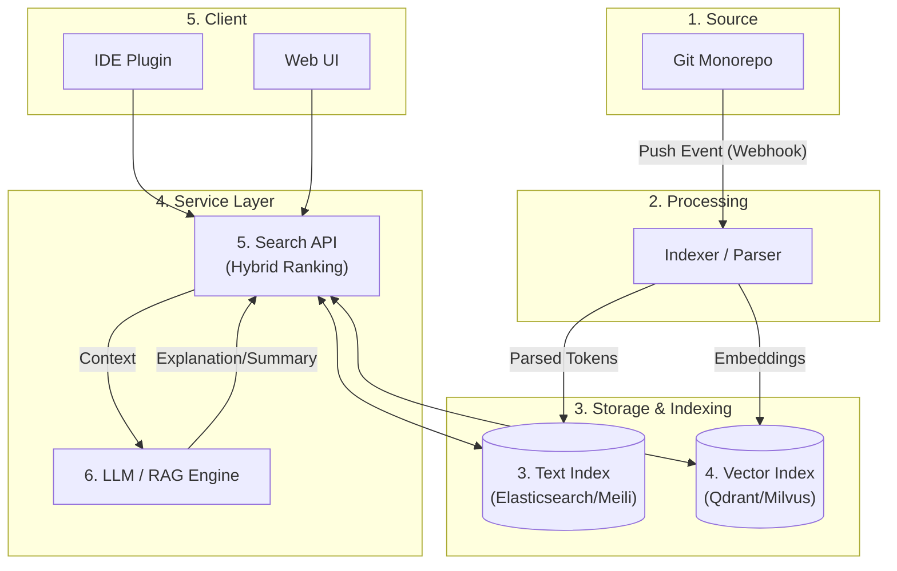

# Monorepo Code Search Engine


회사 Monorepo를 대상으로 **코드를 정확하게 찾아주고(Keyword Match), 의미까지 이해하는(Semantic Search) 검색 엔진** 아키텍처입니다.

대규모 코드베이스에서 개발 생산성을 높이기 위해 텍스트 인덱싱과 벡터 임베딩을 결합한 하이브리드 검색 시스템을 구축합니다.

---

## 📖 목차

1. [개요 및 아키텍처](#-개요-및-아키텍처)
2. [주요 기능](#-주요-기능)
3. [상세 아키텍처](#-상세-아키텍처-pipeline)
    - [1. 코드 수집 (Ingestion)](#1-코드-수집-git-sync)
    - [2. 인덱서 (Indexer)](#2-인덱서-code-parsing--indexing)
    - [3. 텍스트 검색 (Text Index)](#3-텍스트-검색-keyword-index)
    - [4. 의미 검색 (Vector Index)](#4-의미-검색-semantic-index)
    - [5. 검색 API (Search Layer)](#5-검색-api-레이어)
    - [6. LLM/RAG (Optional)](#6-llm--rag-optional)
4. [기술 스택](#-기술-스택)
5. [인프라 및 하드웨어](#-인프라-및-하드웨어)

---

## 📐 개요 및 아키텍처

이 시스템은 Git 저장소의 변경 사항을 실시간으로 추적하여, 텍스트 기반 역색인과 의미 기반 벡터 인덱스를 동시에 생성합니다. 사용자는 자연어와 코드 키워드를 통해 검색할 수 있습니다.

### Data Flow Diagram



---

## 🚀 주요 기능

-   **하이브리드 검색:** 정확한 심볼 매칭(키워드)과 자연어 의도 파악(벡터)을 결합하여 최적의 결과 제공.
-   **코드 블록 단위 인덱싱:** 파일 전체가 아닌 함수/클래스 단위로 쪼개어 정밀한 검색 가능.
-   **실시간 동기화:** Webhook을 통해 코드 변경 사항을 즉시 반영.
-   **AI 기반 코드 설명 (RAG):** 검색된 코드를 LLM이 요약, 설명, 리팩토링 제안.
-   **IDE 통합:** VS Code, JetBrains 등의 IDE에서 에디터 이탈 없이 검색.

---

## 🔍 상세 아키텍처 Pipeline

### 1. 코드 수집 (Git Sync)
> **Role:** Code ingestion, Repository sync

-   **동작:** Git 서버(GitHub Ent, GitLab 등)의 Webhook을 수신하여 변경된 코드만 가져옵니다.
-   **방식:** `read-only`로 로컬 Mirror를 갱신하고, 변경된 파일 목록을 추출하여 인덱싱 큐에 적재합니다.

### 2. 인덱서 (Code Parsing & Indexing)
> **Role:** AST Parsing, Chunking

파일을 단순 텍스트가 아닌 **함수/클래스 단위의 논리적 블록**으로 분할합니다.

-   **Process:**
    1.  언어 감지 (확장자 기반)
    2.  **Tree-sitter**를 사용해 AST 생성
    3.  `function`, `class` 노드 추출 및 메타데이터(Line number, Symbol name) 부착

<details>
<summary>📄 인덱싱 데이터 구조 예시 (JSON)</summary>

```json
{
  "id": "codeblock_1",
  "repo": "company-monorepo",
  "file_path": "apps/api/payment_service.ts",
  "start_line": 1,
  "end_line": 4,
  "symbol_name": "cancelPayment",
  "language": "typescript",
  "raw_code": "export async function cancelPayment(orderId: string) {\n  // 결제 취소 로직\n}\n"
}
```
</details>

### 3. 텍스트 검색 (Keyword Index)
> **Role:** Full-text search, Regex support

-   **목적:** 정확한 함수명(`cancelPayment`), 에러 코드, 정규식 검색 지원.
-   **엔진:** 역색인(Inverted Index) 구조를 사용하는 검색 엔진 활용.
-   **쿼리 예시:** `cancelPayment lang:ts path:apps/api`

### 4. 의미 검색 (Vector Index)
> **Role:** Semantic search, Embeddings

-   **목적:** "결제 취소 로직", "JWT 검증" 등 자연어 쿼리 처리.
-   **Process:** Code-specific Embedding Model을 통해 코드 블록을 고차원 벡터로 변환하여 저장.
-   **거리 계산:** Cosine Similarity 등을 통해 사용자 질의와 가장 유사한 코드 블록 추출.

<details>
<summary>📄 벡터 데이터 구조 예시 (JSON)</summary>

```json
{
  "id": "codeblock_1",
  "embedding": [0.12, -0.03, 0.55, 0.08],
  "metadata": {
    "symbol_name": "cancelPayment",
    "file_path": "apps/api/payment_service.ts"
  }
}
```
</details>

### 5. 검색 API 레이어
> **Role:** Hybrid Search, Ranking

-   **Hybrid Search:** 텍스트 검색 결과(A)와 벡터 검색 결과(B)를 병합.
-   **Reranking:** BM25 점수와 벡터 유사도 점수를 종합(Reciprocal Rank Fusion 등)하여 최종 순위 결정.
-   **인증:** 사내 SSO 연동 및 리포지토리 접근 권한(ACL) 검증.

### 6. LLM / RAG (Optional)
> **Role:** Code Explanation, Summarization

-   검색된 코드 블록을 LLM 프롬프트의 컨텍스트로 주입.
-   **Use Cases:** "이 함수가 하는 일을 요약해줘", "이 코드의 버그 가능성은?"

---

## 🛠 기술 스택

| 분류 | 기술 / 도구 | 비고 |
| :--- | :--- | :--- |
| **Backend** | Python (FastAPI) or Go (Fiber) | 고성능 API 처리 |
| **Parser** | **Tree-sitter** | 언어별 문법 파싱 및 AST 추출 |
| **Text Search** | Elasticsearch, **Meilisearch** | 키워드 검색 엔진 |
| **Vector DB** | **Qdrant**, Milvus, pgvector | 고차원 벡터 검색 |
| **Embedding** | Hugging Face Transformers | CodeBERT, StarCoder 등 코드 특화 모델 |
| **LLM** | Ollama (Llama 3), OpenAI API | RAG 및 코드 설명 생성 |
| **Frontend** | Next.js, React, Tailwind | 검색 UI |

---

## ⚙ 인프라 및 하드웨어

### MVP (Minimum Viable Product) 구성
단일 서버(On-premise or Cloud Instance)에서 컨테이너 기반으로 시작 가능합니다.

-   **Spec:** 8 vCPU, 32GB RAM, 1TB NVMe SSD
-   **Container List:**
    -   `git-service`: 미러링 및 수집
    -   `indexer-worker`: 파싱 및 임베딩 생성
    -   `search-engine`: Meilisearch + Qdrant
    -   `api-server`: 통합 검색 API
    -   `llm-server`: (Optional) Local LLM for simple tasks

### 확장 전략 (Scale-out)
트래픽 및 데이터 증가 시 다음과 같은 순서로 분리합니다.
1.  **Search Cluster:** Elasticsearch/Meilisearch 클러스터 분리
2.  **Vector/GPU:** 벡터 DB 및 임베딩/LLM 추론용 GPU 서버 분리
3.  **Indexer:** 인덱싱 워커 노드 증설

---

## 🤝 Contribution

이 프로젝트는 사내 모노레포의 생산성 향상을 위해 시작되었습니다. 이슈 제보 및 PR은 언제나 환영합니다.

1. Issue 생성
2. Feature Branch (`feat/improved-parser`) 작업
3. Pull Request 요청
