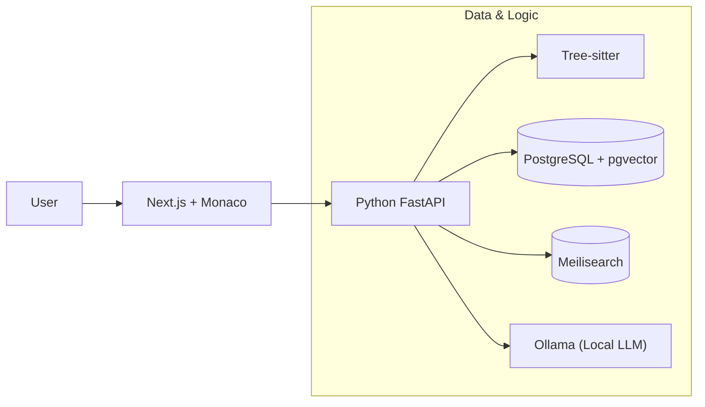

# 🛠️ Open Source Stack for Code Search Engine

이 문서는 **Monorepo 코드 검색 엔진** 구축에 필요한 분야별 추천 오픈 소스 기술 스택을 정리한 문서입니다.
각 도구는 **성능, 안정성, 개발 편의성(DX)**을 기준으로 선정되었습니다.

---

## 1. 💾 데이터 저장소 (Storage Layer)

**Polyglot Persistence(다언어 저장소)** 전략을 위해 각 데이터 특성에 맞는 DB를 사용합니다.

| 도구 이름 | 역할 | 추천 이유 | Link |
| :--- | :--- | :--- | :--- |
| **PostgreSQL** | Primary DB | 메타데이터, 사용자 권한, 로그 관리의 표준. JSONB 지원으로 유연성 확보. | [Web](https://www.postgresql.org/) |
| **pgvector** | Vector Search | PostgreSQL을 벡터 DB로 확장. 별도 DB 구축 없이 SQL로 벡터 검색 가능. | [GitHub](https://github.com/pgvector/pgvector) |
| **Meilisearch** | Text Search | **오타 보정(Typo tolerance)**과 빠른 설정이 강점. Elasticsearch보다 가볍고 빠름. | [GitHub](https://github.com/meilisearch/meilisearch) |
| **Qdrant** | Vector DB | Rust 기반의 초고속 전용 벡터 DB. 수천만 건 이상의 대규모 데이터 처리에 적합. | [GitHub](https://github.com/qdrant/qdrant) |

---

## 2. 🧩 코드 파싱 및 분석 (Parser & Indexer)

코드를 단순 텍스트가 아닌 **구조(AST)**와 **의미(Symbol)**로 이해하기 위한 도구입니다.

| 도구 이름 | 역할 | 추천 이유 | Link |
| :--- | :--- | :--- | :--- |
| **Tree-sitter** | Parser | **업계 표준.** 코드를 구문 트리(AST)로 변환하여 함수/클래스 단위를 정확히 추출. | [GitHub](https://github.com/tree-sitter/tree-sitter) |
| **Zoekt** | Regex Engine | Google에서 만든 Trigram 기반 검색 엔진. 정규식 검색 속도가 압도적임. | [GitHub](https://github.com/google/zoekt) |

---

## 3. 🧠 AI 및 임베딩 (LLM & Intelligence)

코드의 의미를 파악하고(Embedding), 사용자 질문에 답변(RAG)하는 두뇌입니다.

| 도구 이름 | 역할 | 추천 이유 | Link |
| :--- | :--- | :--- | :--- |
| **Ollama** | LLM Runner | 로컬 환경에서 Llama 3, CodeLlama 등을 한 줄 명령어로 실행. 데이터 보안에 최적. | [GitHub](https://github.com/ollama/ollama) |
| **LangChain** | Framework | 검색 결과와 LLM을 연결하는 RAG 파이프라인 구축을 위한 필수 프레임워크. | [GitHub](https://github.com/langchain-ai/langchain) |
| **Hugging Face** | Model Hub | `codebert`, `starcoder` 등 코드 이해에 특화된 임베딩 모델 소스. | [Web](https://huggingface.co/) |

---

## 4. 💻 프론트엔드 및 DX (User Interface)

개발자에게 익숙한 IDE 경험을 웹 브라우저에서 제공합니다.

| 도구 이름 | 역할 | 추천 이유 | Link |
| :--- | :--- | :--- | :--- |
| **Monaco Editor** | Code Editor | **VS Code의 웹 버전 코어.** 신택스 하이라이팅, 미니맵 등 완벽한 코드 뷰어 경험. | [GitHub](https://github.com/microsoft/monaco-editor) |
| **Shadcn/ui** | UI Components | Next.js 기반의 현대적이고 깔끔한 UI 컴포넌트 모음. 빠른 UI 구축 가능. | [Web](https://ui.shadcn.com/) |

---

## 5. 📚 참고할 만한 레퍼런스 (References)

아키텍처 설계 및 구현 시 참고하기 좋은 완성형 오픈 소스 프로젝트입니다.

### [Bloop](https://github.com/BloopAI/bloop)
-   **특징:** Rust로 작성된 로컬 코드 검색 엔진.
-   **배울 점:** 의미 기반 검색과 정규식 검색의 결합 방식, GPT-4 RAG 통합 방식.

### [Sourcegraph](https://sourcegraph.com/)
-   **특징:** 전 세계 1위 코드 검색 플랫폼.
-   **배울 점:** 대규모 모노레포 인덱싱 전략 및 시스템 아키텍처 구조.

---

## 🚀 추천 MVP 조합 (Quick Start)

가장 빠르고 효율적으로 첫 번째 프로토타입을 만들기 위한 조합입니다.

1.  **DB:** PostgreSQL (메타데이터 + 벡터 검색 통합)
2.  **Search:** Meilisearch (텍스트/키워드 검색)
3.  **Backend:** Python FastAPI (AI 라이브러리 호환성 우수)
4.  **Indexer:** Tree-sitter Python binding
5.  **AI:** Ollama (Local Server)
